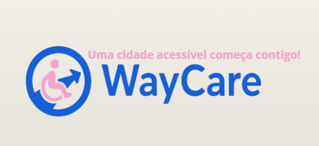
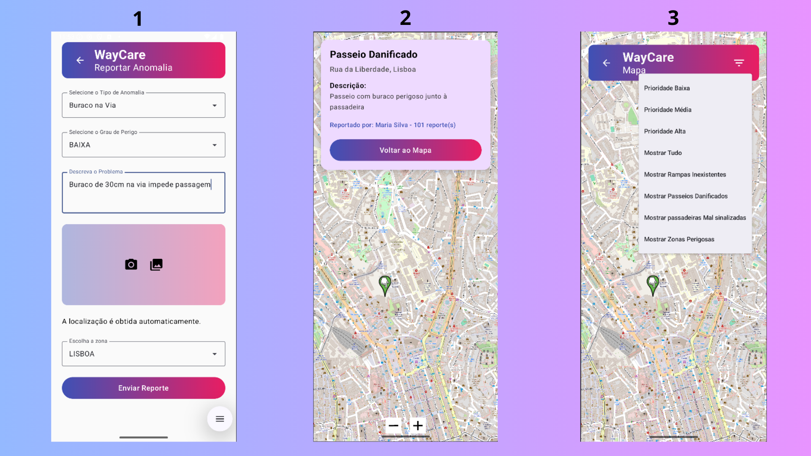

**Licenciatura em Engenharia Informática | Universidade Europeia - IADE | LEIFD02 | 25/26**

**UC** | Projeto de Desenvolvimento Móvel - Projeto Multidisciplinar

**Docente** | Pedro Rosa 

# WayCare
Uma cidade acessível começa contigo! 
## PROJETO MOBILE 
### Relatório - Entrega Final
### Autores
Maria Camila Zamorano Vargas - 20240999 

Cássia Nair Alexandre Baptista - 20231704 

Daniel Alexandre Mbeya Paulo - 20240992 

José Santana Manuel Paim - 20231013

# Link para Repositório no GitHub
https://github.com/macazava/ProjetoMobile-G06.git
# Link para Mockups no Figma
https://www.figma.com/design/sJB2fHMr9FtRiUO07BaGlh/MOCKUPS-FUNCIONAIS?node-id=0-1&t=DExGPdhOVwYb2qfH-1
# Link do Video Promocional
https://www.youtube.com/watch?v=iwS8fHoZi3s
# Palavras-Chave
 Acessibilidade; Mobilidade Urbana; Cidadania Ativa; Tecnologia Cívica; Empatia; Segurança; Autonomia; Reporte Colaborativo; AppMobile; Base de Dados; Programação Mobile; Programação Orientada a Objetos; Frontend; Backend; AndroidStudio; IntelliJ IDEA; mySQL; Springboot; Kotlin; Java; SQL.
# Entrega Final de Projeto (3a Entrega) 
## Nome do Projeto 
 O nome **WayCare** resulta da junção das palavras Care (cuidado) e Way (caminho), refletindo o propósito central da aplicação.
## Enquadramento do Projeto
### Ideia principal
 WayCare é uma aplicação móvel que permite aos cidadãos reportar anomalias urbanas que afetam a circulação de pessoas com mobilidade reduzida, seja esta permanente ou temporária, através de fotos, geolocalização e descrição do problema. A WayCare é uma aplicação social que funciona como um canal de ajuda e consciência coletiva. Para além de permitir que pessoas com mobilidade reduzida reportem obstáculos urbanos, também estes problemas podem ser reportados por familiares, cuidadores e cidadãos em geral, mesmo aqueles que nunca passaram por essa experiência, podem identificar e sinalizar situações que comprometem a acessibilidade, como por exemplo, rampas inexistentes, passeios danificados, passadeiras mal sinalizadas ou zonas perigosas podem ser reportadas. Ao promover empatia e envolvimento comunitário, a app contribui para cidades mais justas, seguras e verdadeiramente pensadas para todos.
### Contexto em que se insere
 O projeto WayCare nasce da vontade de tornar as cidades mais acessíveis, seguras e inclusivas para todos. Inserido no contexto da cidadania ativa, da gestão urbana consciente e da tecnologia com propósito social, WayCare responde a um problema real e urgente: os obstáculos físicos que dificultam a mobilidade de milhares de pessoas, sejam estas limitações permanentes, temporárias ou relacionadas com a idade. 

Em muitas cidades portuguesas, situações como rampas inexistentes, obras sem alternativas seguras ou passeios degradados continuam a comprometer o direito à circulação com dignidade. A aplicação WayCare surge como uma ferramenta de apoio e sensibilização coletiva, permitindo que qualquer cidadão, seja utilizador direto, familiar ou simplesmente solidário, possa reportar estes obstáculos de forma rápida e intuitiva. 

Mais do que uma app, WayCare promove empatia urbana e envolvimento comunitário, contribuindo para uma cidade pensada com e para as pessoas. Ao integrar-se na lógica das Smart Cities e tirar partido da tecnologia móvel, a aplicação permite uma resposta mais ágil e eficaz por parte das autoridades locais, baseada em dados reais e geolocalizados. 

WayCare posiciona-se como uma solução de Civic Tech, onde a inovação tecnológica se coloca ao serviço da inclusão social, da participação cidadã e da construção de espaços públicos mais justos e funcionais.
#### Contexto Nacional que nos levou ao Desenvolvimento da nossa Proposta 
 A importância da WayCare é reforçada por dados que evidenciam a urgência de melhorar a acessibilidade nas infraestruturas urbanas: 
- Relatórios do Instituto Nacional de Estatística (INE) apontam um aumento significativo de queixas sobre infraestruturas urbanas em cidades como Lisboa, Porto e Braga. 
- A Associação Nacional de Municípios Portugueses (ANMP) destaca que muitas obras públicas não consideram adequadamente a acessibilidade para pessoas com mobilidade reduzida, grávidas ou idosos, evidenciando a necessidade de soluções que envolvam os cidadãos na identificação desses problemas. 
 WayCare responde a esta realidade, oferecendo uma plataforma que permite reportar obstáculos em tempo real, contribuindo para uma cidade mais acessível, funcional e inclusiva. 
### Objetivos
1. Facilitar o reporte de obstáculos urbanos que dificultam a mobilidade de pessoas com limitações físicas, permitindo que qualquer cidadão possa sinalizar problemas de forma rápida, intuitiva e acessível. 
2. Melhorar a qualidade de vida dos utilizadores dando visibilidade a situações críticas que afetam diretamente pessoas com mobilidade reduzida seja por deficiência, idade avançada, gravidez ou recuperação pós-cirúrgica, promovendo uma cidade mais segura, autónoma, inclusiva e consciente. 
3. Contribuir para a melhoria da acessibilidade urbana, através da identificação em tempo real de zonas problemáticas como passadeiras sem rampas, obras mal sinalizadas ou passeios degradados, permitindo uma atuação mais eficaz. 
4. Apoiar os serviços municipais na tomada de decisão, fornecendo dados geolocalizados e organizados por categoria, que facilitam uma resposta mais ágil, precisa e orientada para a inclusão social. 
5. Fomentar a consciência coletiva e a participação cívica ativa, incentivando todos os cidadãos, mesmo aqueles que nunca enfrentaram limitações físicas, a colaborar na construção de espaços públicos mais empáticos e acessíveis. 
6. Alertar os utilizadores sobre obstáculos nas proximidades, indicando com precisão a localização das anomalias reportadas, para que possam planear rotas alternativas e circular com maior segurança. 
### Público Alvo 
 O nosso público alvo é a cidadania no geral fazendo ênfase em pessoas com algum tipo de deficiência ou mobilidade reduzida:  
- Pessoas com mobilidade reduzida (temporária ou permanente) 
- Cuidadores, familiares e profissionais de saúde 
- Cidadãos solidários que querem ajudar 
- Autarquias e serviços municipais 
### Aplicações semelhantes no Mercado e o Valor Acrescentado da WayCare 
 Embora existam aplicações que abordam a temática da acessibilidade, como a **Accessibility 360 App** e **+Acesso Para Todos**, desenvolvida pelo Instituto Nacional para a Reabilitação (INR) e a Associação Salvador, respetivamente, o projeto **WayCare** apresenta uma abordagem mais abrangente, participativa e centrada na realidade urbana. 

 A **Accessibility 360 App** foca-se essencialmente na consulta da acessibilidade de edifícios públicos, como hospitais, escolas ou lojas do cidadão. A sua funcionalidade principal é informar os utilizadores sobre as condições de acesso a serviços públicos, com destaque para lugares de estacionamento reservados e acessos internos. Trata-se de uma ferramenta útil, mas com um alcance limitado ao espaço institucional. 

 Já a **+Acesso Para Todos** permite aos cidadãos denunciar barreiras arquitetónicas em espaços públicos e privados, promovendo boas práticas e enviando automaticamente reclamações para o INR ou para os municípios. Apesar de ser uma iniciativa relevante, o seu foco está na denúncia formal e na classificação de espaços, sem funcionalidades interativas como mapa em tempo real ou alertas de proximidade, opções que realmente ajudam aos utilizadores no dia a dia, realmente no momento que eles precisam. 

 Por outro lado, **WayCare** atua diretamente no espaço público urbano como ruas, passeios, passadeiras e zonas em obras, permitindo que qualquer cidadão possa reportar obstáculos à mobilidade de forma intuitiva e colaborativa. A aplicação não se destina apenas a pessoas com mobilidade reduzida, mas também a familiares, cuidadores e cidadãos solidários, promovendo uma rede de empatia urbana e envolvimento comunitário. 

Entre as suas funcionalidades inovadoras destaca-se o sistema de notificações de proximidade, que alerta os utilizadores quando se encontram perto de zonas reportadas como inacessíveis, permitindo-lhes planear rotas alternativas e circular com maior segurança e autonomia. Ao disponibilizar dados geolocalizados e organizados por categoria, o WayCare apoia os serviços municipais na tomada de decisões mais eficazes e orientadas para a inclusão. 
## Definição das Personas e Guiões
### Personas 
#### Maria Silva
- **Idade:** 34 anos  
- **Profissão:** Técnica administrativa  
- **Mobilidade:** Utiliza cadeira de rodas elétrica  
- **Localização:** Lisboa 
- **Motivação:** Circular pela cidade com segurança e autonomia, evitando obstáculos que comprometam a acessibilidade.  
- **Necessidades principais:**  
  - Percursos acessíveis e atualizados  
  - Alertas de obstáculos que impeçam a passagem  
  - Possibilidade de reportar anomalias de forma rápida e intuitiva

#### João Ferreira
- **Idade:** 28 anos  
- **Profissão:** Estudante universitário  
- **Mobilidade:** Temporariamente reduzida (uso de muletas devido a fratura)  
- **Localização:** Porto  
- **Motivação:** Deslocar-se de forma segura até transportes e locais de estudo, evitando riscos.  
- **Necessidades principais:**  
  - Receber notificações de obstáculos próximos  
  - Obter rotas alternativas seguras em tempo real  
  - Visualizar facilmente fotos e descrições de anomalias
 
#### Pedro Costa
- **Idade:** 41 anos  
- **Profissão:** Técnico municipal de obras públicas  
- **Mobilidade:** Sem restrições, mas sensível a questões de segurança urbana  
- **Localização:** Braga    
- **Motivação:** Alertar a comunidade sobre riscos urbanos e contribuir para a segurança coletiva.  
- **Necessidades principais:**  
  - Reportar rapidamente obstáculos com fotografias  
  - Enviar alertas de situações perigosas (ex: entulhos, quedas de árvores)  
  - Garantir que a informação chegue aos outros utilizadores em tempo real  

---

### Guiões de Utilização (Cenários)

#### Reporte de obra sem aviso e desvio de rota
Persona: Maria Silva  
##### Contexto
Maria utiliza cadeira de rodas elétrica e realiza todos os dias o mesmo percurso até ao trabalho, em ruas acessíveis e seguras.  

##### Acontecimento
Numa terça-feira de manhã, ao chegar ao cruzamento da Rua Central, encontra o passeio bloqueado por uma obra iniciada sem aviso. A Maria é consciente que não só lhe afeta a ela como também pode afetar a outros usuários, então procede a abrir a WayCare.

##### Ações na WayCare
1. Abre a aplicação WayCare e seleciona “Reportar Anomalia”.  
2. Maria tira uma fotografia do bloqueio e adiciona a descrição:
 > “Obra iniciada sem aviso. Passeio totalmente bloqueado, sem alternativa para cadeiras de rodas.”
3. A app identifica automaticamente a geolocalização da obra.  
4. Classifica o reporte como Alta Prioridade.  
5. Após submeter, consulta o mapa e vê refletido o seu reporte.  

Para além do seu reporte, no mapa também aparecem os reportes dos outros utilizadores da App, então a Maria analiza um caminho alternativo seguro por onde não tem obstáculos, cerca de 10 minutos mais longo, mas totalmente acessível e validado por outros utilizadores.
Maria consegue chegar ao trabalho em segurança, sentindo uma satisfação enorme pois contribuiu para alertar outros cidadãos.

---

#### Consulta de anomalia reportada
Persona: João Ferreira   
##### Contexto
João está a recuperar de uma fratura na perna e desloca-se de muletas até à paragem de autocarro.  

##### Acontecimento
Enquanto caminha pela Rua da Liberdade, João abre a aplicação WayCare para verificar se existem anomalias reportadas na sua zona.

##### Ações na WayCare
1. João acede ao mapa interativo e identifica um obstáculo previamente registado por outro utilizador.
2. A app mostra a fotografia e a descrição da anomalia.
3. Assim, João utiliza a informação disponível (mapa e descrição) para decidir o percurso mais seguro até à paragem.  

João consegue evitar o obstáculo graças às informações partilhadas pela comunidade. Reconhece o potencial da WayCare como ferramenta preventiva de mobilidade seguras.

---

#### Reporte de obstáculos após tempestade
Persona: Pedro Costa   

##### Contexto
Após uma tempestade noturna, Pedro, usuário da App mas não é condicionado pela mobilidade reduzida, precisa deslocar-se ao trabalho.  
Nas ruas encontra entulhos, árvores caídas e zonas inundadas, o que representa risco para peões.

##### Ações na WayCare
1. Abre a app e seleciona “**Reportar Anomalia**”.  
2. Tira uma fotografia que reflete o estado da situação: árvores caídas, buracos inundados, passeios bloqueados.  
3. A **geolocalização automática** regista o local exato.  
4. Escreve a descrição:
   > “Passeios bloqueados por entulho e árvores caídas. Risco elevado para pedestres. Intervenção urgente necessária.”  
5. Classifica o alerta como **Prioridade Alta** e submete.  

Os reportes de Pedro ficam visíveis para outros utilizadores.  
A ação de Pedro ajuda a evitar acidentes e a melhorar a segurança nas rotas pedonais.

--- 

## Enquadramento nas diversas Unidades Curriculares e Tecnologias Utilizadas 
 O desenvolvimento do projeto WayCare articula conhecimentos adquiridos em várias UC, permitindo aplicar competências técnicas, analíticas e comunicacionais de forma integrada: 
- **Programação Orientada a Objetos**: Tratamos dos requisitos e arquitetura (MVC e REST) do código garantindo modularidade, reutilização e manutenção eficiente. Utilização da linguagem de programação Java, da tecnologia Spring Boot e VScode como editor de código.
- **Bases de Dados**: Modelação e implementação da base de dados que armazena os reportes dos utilizadores, incluindo localização, tipo de obstáculo e fotografia. Utilização de SQL, MAMP e MySQL Workbench e conceitos de normalização para garantir integridade e desempenho. 
- **Programação de Dispositivos Móveis**: Desenvolvimento da interface da aplicação para dispositivos móveis, com foco na navegação intuitiva e integração com funcionalidades como GPS, câmara e notificações. Recorrendo a Android Studio 2025 1.3.7 utilizando Kotlin e Jetpack Compose. 
- **Competências Comunicacionais**: Elaboração de conteúdos claros e acessíveis para o público-alvo, incluindo textos informativos na app, apresentação do projeto e comunicação visual no poster e nos materiais de divulgação. Utilizando tecnologias como Canva, PowerPoint e Word. 
- **Matemática Discreta**: Aplicação de conceitos como lógica para o planeamento de rotas alternativas e para a estruturação eficiente dos dados geográficos e relacionais. 
- **Desenvolvimento de Projeto**: Planeamento, execução e validação do projeto em todas as suas fases, desde a definição dos requisitos até à apresentação final, com foco na gestão de tempo, trabalho em equipa e resolução de problemas, utilizando plataformas como ClickUp, Discord, GitHub e Figma. 
## Arquitetura da Solução
 A solução tem como base uma arquitetura em três camadas (frontend, backend e base de dados).  

A camada de **frontend** (Camada de Apresentação) corresponde à interface da aplicação movel que o utilizador vê e interage, permitindo reportar obstáculos, visualizar o mapa e receber alertas. O **backend** (Camada Lógica / Servidor) trata da lógica da aplicação sendo responsável pelo processamento dos dados e regras de negócio, e ainda da comunicação entre o frontend e a **base de dados**. Por fim, a base de dados (Camada de Armazenamento) armazena os reportes de forma segura e organizada. A aplicação recorre ainda a APIs de geolocalização, garantindo uma experiência interativa e precisa na navegação urbana. 
## Planeamento, Calendarização e Distribuição de tarefas (Tabela)
A seguir é apresentado o **link direto ao ClickUp**, que o professor tem acesso, para a visualização em calendário, e ainda uma tabela com os nomes de todos os participantes e o que cada uma realizou ao longo do semeste para a conclusão do Projeto Mobile: 
- https://app.clickup.com/90151677947/v/o/s/90156930935
- [Tabela de tarefas realizadas por cada participante do grupo](Documentação/tabeladetarefas.pdf)

### Requisitos Funcionais
 Dentro dos requisitos funcionais da WayCare para a entrega final encontra-se:
- Permitir que qualquer cidadão reporte obstáculos urbanos (Ex: rampas inexistentes, passeios danificados);
- Capturar e anexar fotografias ao reporte;
- Registar a localização automática do obstáculo via GPS;
- (opcional) Permitir ajustar manualmente a localização;
- Categorizar o tipo de obstáculo (ex: obras, acessos, sinalização);
- Enviar o reporte para uma base de dados acessível;  
- Visualizar os obstáculos reportados num mapa interativo;
- Receber notificações quando o utilizador se aproxima de uma zona reportada;
- Permitir que os utilizadores filtrem os obstáculos por tipo ou gravidade; 
- (opcional) Sugestão de rotas com boa acessibilidade.
#### Funcionalidades não expostas ao utilizador
Apesar dos avanços alcançados no desenvolvimento do projeto, algumas funcionalidades previstas inicialmente não se encontram disponíveis para o utilizador, uma vez que, embora a lógica esteja totalmente implementada no backend, não foi realizada a integração com o frontend:

- **Notificações de proximidade**: a lógica de geolocalização e deteção de pontos de interesse foi desenvolvida e encontra-se operacional no backend. No entanto, não foi criada a camada de interface que permitisse ao utilizador receber notificações visuais ou sonoras no frontend.
- **Sugestão de rotas alternativas**: os algoritmos de cálculo de rotas e análise de trajetos foram implementados no backend, garantindo a capacidade de gerar diferentes opções de percurso. Contudo, a funcionalidade não foi ligada ao frontend, impedindo que o utilizador visualize ou selecione essas alternativas diretamente na aplicação.

Estas funcionalidades permanecem como potenciais melhorias futuras, bastando a integração da lógica já existente no backend com o frontend para que possam ser disponibilizadas ao utilizador.

### Requisitos Não Funcionais 
 Dentro dos requisitos funcionais da WayCare tem-se:
- A aplicação deve ser intuitiva e fácil de usar por qualquer cidadão; 
- Devem ser implementadas características como localização e utilização de mapas; 
- Os dados devem ser armazenados de forma segura e protegida, respeitando o RGPD; 
- A aplicação deve estar disponível 24/7, com alta fiabilidade; 
- Deve permitir atualizações regulares sem comprometer a experiência do utilizador; 
- O sistema deve ser escalável para suportar um número crescente de utilizadores e reportes. 

# Mockups
 Foram escolhidas as três telas principais da App: 
1. Tela de Reporte de Anomalia.
2. Tela de Detalhes do Reporte na Visualização em Mapa.
3. Tela da visualização do mapa interativo (com filtros).

# Esboço do Diagrama de Classes UML
O diagrama abaixo representa a estrutura conceptual do sistema WayCare, evidenciando as principais classes e as relações lógicas da base de dados WayCare
.jpeg)

# Versão final da documentação REST 
A seguir é apresentada a documentação REST, que foi elaborada com o objetivo de descrever de forma estruturada os endpoints disponibilizados pelo backend da aplicação.

- [WayCare – Api REST Backend](Documentação/DocumentaçãoRest(versaofinal).pdf)

# Dicionário de Dados (BD-Versão Final)
O presente dicionário de dados descreve a estrutura da base de dados WayCare, de acordo com o novo modelo lógico implementado. Esta base de dados suporta uma aplicação de reporte de anomalias urbanas, incluindo utilizadores, anomalias, localizações,reportes, fotografias, comentários, notificações e rotas alternativas.
- [Dicionário de dados](Documentação/DocumentaçãoBD/DicionárioDeDados(versãofinal).pdf)

# Guia de Dados (BD-Versão Final)
A seguir apresentamos a Guia de Dados, com o objetivo de fornecer uma visão estruturada e detalhada sobre os principais elementos de informação utilizados no projeto. 
Esta secção descreve os modelos de dados, os campos que os compõem, os tipos e restrições associados, bem como as relações estabelecidas entre entidades. 
- [Guia de Dados](Documentação/DocumentaçãoBD/GuiaDeDados(versaofinal).pdf)

# Manual de Utilizador 
O Manual de Utilizador foi elaborado com o objetivo de orientar de forma simples e clara a utilização da aplicação WayCare. Esta secção descreve os principais passos que o utilizador deve seguir para reportar anomalias, consultar o mapa interativo e aceder às funcionalidades disponíveis. 
A intenção é garantir que qualquer pessoa, independentemente do seu nível de experiência tecnológica, consiga utilizar a aplicação de forma intuitiva e eficaz.
- [Manual de Utilizador]()

# Conclusão
 O projeto WayCare permite refletir sobre como a tecnologia pode ser colocada ao serviço da inclusão social e da melhoria da qualidade de vida nas cidades. Este trabalho partiu da constatação de que, em muitas localidades, a acessibilidade continua a ser um desafio diário para milhares de pessoas. Barreiras físicas como passeios danificados, rampas inexistentes, obras mal sinalizadas ou obstáculos temporários comprometem o direito básico de circular em segurança e autonomia.  

 A WayCare surge, assim, como uma resposta a esse problema, assumindo-se como uma aplicação móvel. Através da geolocalização, do registo fotográfico e da categorização de anomalias, qualquer cidadão pode reportar situações que afetam a mobilidade urbana. A solução reside na sua dimensão colaborativa: mais do que um sistema de denúncia, trata-se de uma rede de participação ativa, que incentiva a empatia e o envolvimento comunitário. 

Pretende-se que os objetivos traçados no início do projeto sejam atingidos de forma consistente: Disponibilizar uma ferramenta intuitiva que permita reportar obstáculos urbanos de forma rápida e acessível; dar visibilidade a problemas críticos que impactam diretamente pessoas com mobilidade reduzida, grávidas, idosos ou cidadãos em recuperação temporária; fornecer dados organizados e geolocalizados que possam apoiar as autarquias e serviços municipais na tomada de decisões; fomentar a participação cívica e a consciencialização coletiva, incentivando todos os cidadãos a colaborar; aumentar a segurança e a autonomia dos utilizadores através de alertas de proximidade e planeamento de rotas alternativas.  

Para além dos aspetos funcionais, este projeto permitiu-nos articular e aplicar conhecimentos adquiridos em várias unidades curriculares, desde a programação orientada a objetos e o desenvolvimento mobile até ao trabalho com bases de dados, planeamento de projeto e competências comunicacionais. Essa integração mostrou-se essencial para construir uma solução coerente, funcional e fundamentada. 

 Outro aspeto relevante foi a experiência de trabalho em equipa, que exigiu gestão de tempo, divisão de responsabilidades, coordenação e capacidade de resolver problemas de forma colaborativa. Estas competências, importantes quanto a componente técnica, reforçaram o caráter multidisciplinar do projeto e mostraram-nos a importância de alinhar diferentes perspetivas em torno de um objetivo comum. 

Em suma, a WayCare não deve ser vista apenas como uma aplicação tecnológica, mas como uma ferramenta de transformação social. Ao unir inovação, empatia e responsabilidade coletiva, o projeto contribui para a construção de cidades mais humanas, inclusivas e seguras, onde todos têm o direito de se mover com dignidade. 

# Bibliografia
AccessNow. (2023). Accessibility mapping and reporting tools for inclusive cities. AccessNow. 

Associação Nacional de Municípios Portugueses. (2023). Relatório sobre acessibilidade e mobilidade urbana. ANMP. 

European Commission. (2021). European disability strategy 2021–2030. Publications Office of the European Union. 

Gehl, J. (2010). Cities for people. Island Press. 

Instituto Nacional de Estatística. (2022). Relatório sobre infraestruturas urbanas em Portugal. INE. 

United Nations. (2015). Transforming our world: The 2030 agenda for sustainable development. United Nations. 

World Health Organization. (2018). Global report on urban health: Equitable, healthier cities for sustainable development. WHO. 

Instituto Nacional de Estatística. (2022). Relatório de Contas e Informação de Projetos 2022 (RCIP). Infraestruturas de Portugal.  

Associação Nacional de Municípios Portugueses. (2023). Relatório de consulta – Ferrovia 2023. Autoridade da Mobilidade e dos Transportes. 
