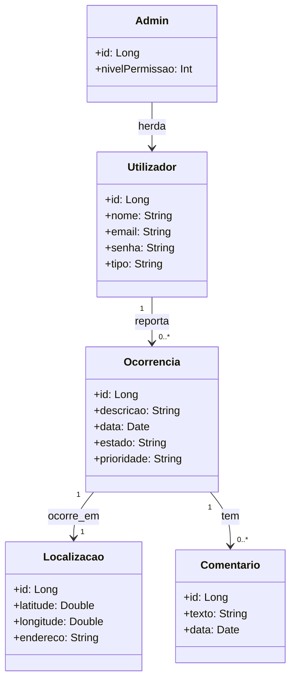

# Esboço do Diagrama de Classes UML

O diagrama abaixo representa a estrutura conceptual do sistema **WayCare**, evidenciando as principais classes e as relações entre elas.

```mermaid
classDiagram
    class Utilizador {
        +id: Long
        +nome: String
        +email: String
        +senha: String
        +tipo: String
    }

    class Ocorrencia {
        +id: Long
        +descricao: String
        +data: Date
        +estado: String
        +prioridade: String
    }

    class Localizacao {
        +id: Long
        +latitude: Double
        +longitude: Double
        +endereco: String
    }

    class Comentario {
        +id: Long
        +texto: String
        +data: Date
    }

    class Admin {
        +id: Long
        +nivelPermissao: Int
    }

    Utilizador "1" --> "0..*" Ocorrencia : reporta
    Ocorrencia "1" --> "1" Localizacao : ocorre_em
    Ocorrencia "1" --> "0..*" Comentario : tem
    Admin --> Utilizador : herda
```